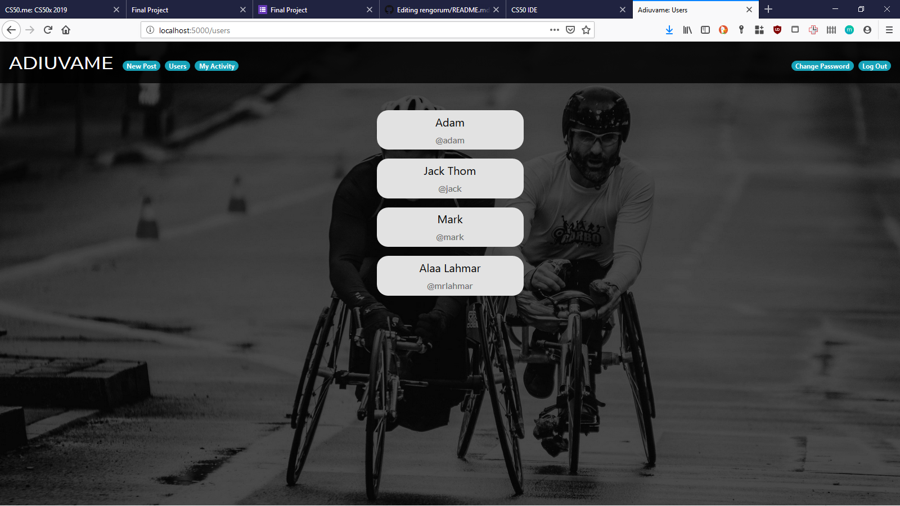

# Adiuvame

## Project Specification

This Adiuvame, my CS50 final project, Adiuvame is a latin word that means "Help me" the idea is simple , anyone who have a wheelchair, bed or any medical equipment that he want to donate , he just need to head over to adiuvame create an account and create new post and describe what the product is all about and the person who want to benefit from this product he just can comment or contact him via email, and vice versa, if any one want some sort of used medical equipment he just create a new post and those who can help they just need to comment or email the post writer.

## Screenshots





# What Technologies I've used

## Frontend

HTML5,CSS3,Bootstrap

## Backend:

Python (Flask)

## List of routes:
```
* /
* /users
* /posts/{{posid}}
* /myactivity
* /logout
* /publish
* /register
* /login
* /users/{{username}}
* /delete/{{postid}}
* /changepassword
* /terms
* /about
* /posts --> /
```

## Database

For this project I used a PostgreSQL database that communicates with the sqlalchemy python library
( you should find a sql file on the preview folder that will help you create the database and insert some data to play with it)

| Tables  | Function                |
|---------|-------------------------|
| users   | Store users information |
| post    | Store post information  |
| comment | Store comments          |

## Installation

Make sure you have following software installed in your system:

* Python 3
* Git

First, we need to clone the repository
```
git clone https://github.com/mrlahmar/adiuvame.git
```

Install all required dependencies in an isolated environment with these commands

```
python3 -m venv venv
source venv/bin/activate
pip install -r requirements.txt
```

Open your command line and type

```
set FLASK_APP=application.py
flask run
```

Start your browser and type

```
localhost:5000
```

Happy Coding!